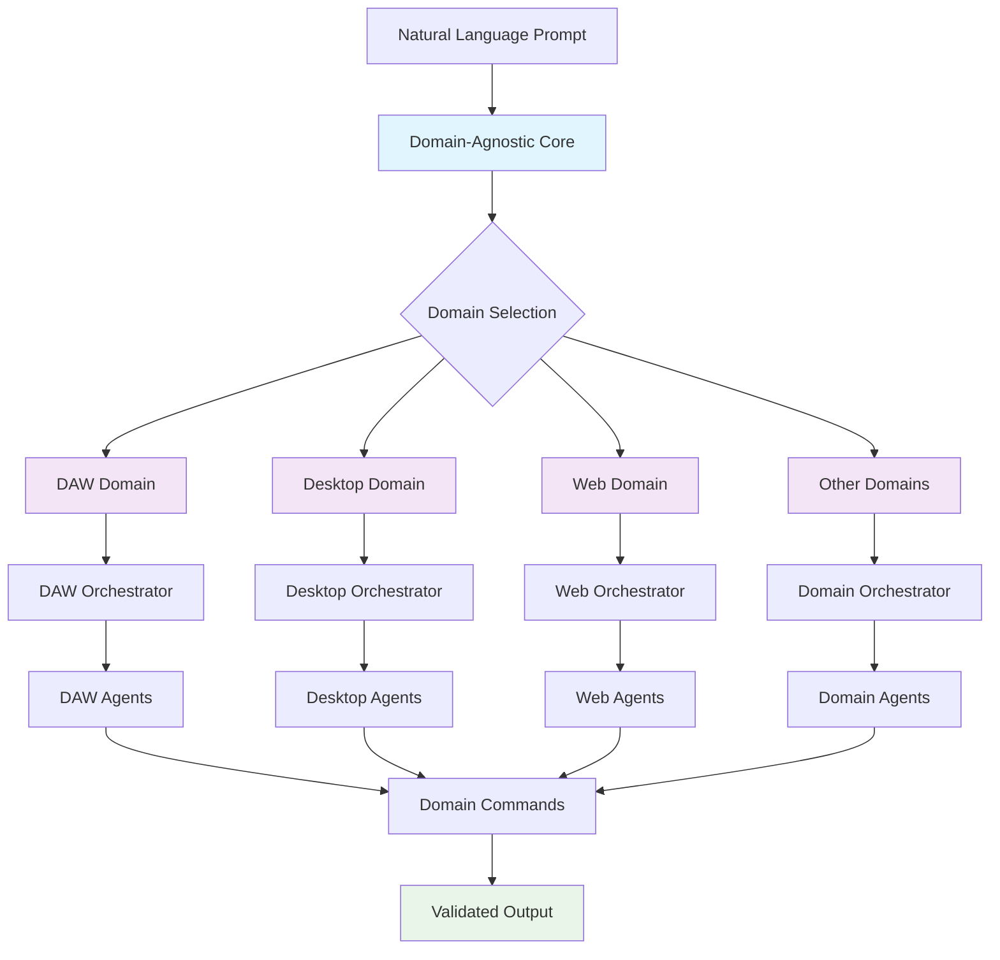

[](https://github.com/lucaromagnoli/magda/actions)
[](https://www.python.org/downloads/)
[](https://isocpp.org/std/the-standard)
[](https://opensource.org/licenses/GPL-3.0)

# MAGDA

<div align="center">

```
     MAGDA
   🎵 🎹 🎤 🐍 ⚡ 🦀

  Multi Agent
 Domain Automation
```

</div>

**Multi Agent Domain Automation**

MAGDA is a revolutionary AI-driven system that translates natural language prompts into domain-specific commands using a sophisticated multi-agent architecture. While currently implemented for DAW (Digital Audio Workstation) automation, the architecture is designed to support any domain - from desktop automation to cloud operations.

## 🌟 Features

[](https://openai.com/)
[](https://pydantic.dev/)
[](https://en.wikipedia.org/wiki/Multi-agent_system)
[](https://en.wikipedia.org/wiki/Domain-driven_design)

### 🎯 Core Capabilities
- **Natural Language Processing**: Convert plain English into precise domain commands
- **Multi-Agent Architecture**: Specialized agents for different operations
- **Domain-Agnostic Design**: Support for any domain (DAW, Desktop, Web, Cloud, etc.)
- **Host Integration**: Context-aware operations with host-provided data
- **Structured Output**: Validated JSON responses with Pydantic models
- **Multilingual Support**: Works with English, Spanish, French, German, Italian, and more
- **Operation Chaining**: Handle complex multi-step operations in a single prompt
- **Real-time Processing**: Fast response times with OpenAI's latest models

### 🏗️ Supported Domains

| Domain | Status | Description | Example Operations |
|--------|--------|-------------|-------------------|
| **DAW** | ✅ Implemented | Digital Audio Workstation automation | Create tracks, add effects, control volume |
| **Desktop** | 🚧 Planned | Desktop automation | File operations, window management |
| **Web** | 🚧 Planned | Browser automation | Navigation, form filling, scraping |
| **Mobile** | 🚧 Planned | Mobile app automation | App interactions, device control |
| **Cloud** | 🚧 Planned | Cloud platform automation | AWS, Azure, GCP operations |
| **Business** | 🚧 Planned | Business process automation | CRM, email, reporting |

## 🏗️ Architecture

MAGDA uses a **domain-agnostic architecture** that separates core functionality from domain-specific implementations:

### 🎯 Domain-Agnostic Core

```python
# Core interfaces that work for any domain
from magda.core.domain import DomainType, DomainAgent, DomainOrchestrator
from magda.core.pipeline import MAGDACorePipeline

# Domain-specific implementations
from magda.domains.daw import DAWFactory
from magda.domains.desktop import DesktopFactory  # Future
from magda.domains.web import WebFactory         # Future
```

### 🏗️ Architecture Components

#### **1. Domain-Agnostic Interfaces**
- **`DomainAgent`**: Abstract base for all agents
- **`DomainOrchestrator`**: Abstract base for orchestrators
- **`DomainPipeline`**: Abstract base for pipelines
- **`DomainFactory`**: Factory pattern for domain creation

#### **2. Domain Implementations**
- **DAW Domain**: Track, Volume, Effect, Clip, MIDI agents
- **Desktop Domain**: File, Window, App, System agents (planned)
- **Web Domain**: Browser, Form, Navigation agents (planned)

#### **3. Two-Stage Pipeline**
1. **Orchestration**: Identify operations from natural language
2. **Execution**: Route to specialized domain agents

### 🔄 Pipeline Flow



## 🚀 Quick Start

### Prerequisites

- Python 3.12+
- OpenAI API key
- [uv](https://docs.astral.sh/uv/) package manager

### Installation

1. **Clone the repository**:
   ```bash
   git clone https://github.com/lucaromagnoli/magda.git
   cd magda
   ```

2. **Install Python dependencies**:
   ```bash
   cd python
   uv sync
   ```

3. **Set up environment**:
   ```bash
   cp env.example .env
   # Edit .env and add your OpenAI API key
   ```

4. **Install the Python package**:
   ```bash
   uv pip install -e .
   ```

### Usage Examples

#### 🎵 DAW Domain (Current Implementation)

```python
from magda.core.domain import DomainType
from magda.core.pipeline import MAGDACorePipeline
from magda.domains.daw import DAWFactory

# Create DAW pipeline
daw_factory = DAWFactory()
pipeline = MAGDACorePipeline(daw_factory, DomainType.DAW)

# Set host context (from Reaper, Logic, etc.)
pipeline.set_host_context({
    "vst_plugins": ["serum", "addictive drums", "kontakt"],
    "track_names": ["bass", "drums", "guitar", "lead"],
    "fx_chain": ["reverb", "compression", "eq"]
})

# Process DAW prompts
result = pipeline.process_prompt("create bass track with serum")
print(result["commands"])
```

#### 🖥️ Desktop Domain (Future)

```python
from magda.domains.desktop import DesktopFactory

# Create Desktop pipeline
desktop_factory = DesktopFactory()
pipeline = MAGDACorePipeline(desktop_factory, DomainType.DESKTOP)

# Set host context (from OS)
pipeline.set_host_context({
    "installed_apps": ["chrome", "vscode", "terminal"],
    "file_system": "/home/user"
})

# Process Desktop prompts
result = pipeline.process_prompt("open chrome and navigate to google.com")
```

#### 🌐 Web Domain (Future)

```python
from magda.domains.web import WebFactory

# Create Web pipeline
web_factory = WebFactory()
pipeline = MAGDACorePipeline(web_factory, DomainType.WEB)

# Set host context (from browser)
pipeline.set_host_context({
    "current_url": "https://example.com",
    "available_forms": ["login", "search", "contact"]
})

# Process Web prompts
result = pipeline.process_prompt("fill login form with username and password")
```

## 📝 Examples

### 🎵 DAW Operations

```bash
# Basic track creation
magda "create a track for bass and one for drums"

# Complex multi-step operations
magda "create a bass track with Serum, add a compressor effect with 4:1 ratio, and set the volume to -6dB"

# Multilingual support
magda "crear una pista de bajo con Serum y aplicar compresión"
```

### 🖥️ Desktop Operations (Future)

```bash
# File operations
magda "create a new folder called 'projects' and move all .py files there"

# Application management
magda "open Chrome, navigate to github.com, and search for 'python projects'"

# System operations
magda "take a screenshot and save it to the desktop"
```

### 🌐 Web Operations (Future)

```bash
# Browser automation
magda "go to amazon.com, search for 'python books', and add the first result to cart"

# Form filling
magda "fill the contact form with my email and message"

# Data extraction
magda "scrape all product prices from the current page"
```

## 🏗️ Adding New Domains

MAGDA's domain-agnostic design makes it easy to add new domains:

### 1. Create Domain Agents

```python
# magda/domains/desktop/desktop_agents.py
from magda.core.domain import DomainAgent, DomainType

class DesktopFileAgent(DomainAgent):
    def __init__(self):
        super().__init__(DomainType.DESKTOP)

    def can_handle(self, operation: str) -> bool:
        return operation.lower() in ["file", "create file", "delete file"]

    def execute(self, operation: str, context: DomainContext) -> OperationResult:
        # Desktop-specific implementation
        pass
```

### 2. Create Domain Factory

```python
# magda/domains/desktop/desktop_factory.py
from magda.core.domain import DomainFactory

class DesktopFactory(DomainFactory):
    def create_agents(self, domain_type: DomainType) -> Dict[str, DomainAgent]:
        return {
            "file": DesktopFileAgent(),
            "window": DesktopWindowAgent(),
            "app": DesktopAppAgent(),
        }
```

### 3. Use the New Domain

```python
# Create and use the new domain
desktop_factory = DesktopFactory()
pipeline = MAGDACorePipeline(desktop_factory, DomainType.DESKTOP)
result = pipeline.process_prompt("create a new folder called 'documents'")
```

## 🧪 Testing

### Run Tests

```bash
# Run all tests
pytest

# Run specific domain tests
pytest tests/test_daw_domain.py
pytest tests/test_desktop_domain.py  # Future

# Run with coverage
pytest --cov=magda --cov-report=html
```

### Run Examples

```bash
# Run domain-agnostic demo
python example_domain_agnostic.py

# Run DAW-specific tests
python test_operations_benchmark.py
```

## 🤝 Contributing

We welcome contributions! Here's how you can help:

### 🎯 Adding New Domains

1. **Create domain directory**: `magda/domains/your_domain/`
2. **Implement agents**: Inherit from `DomainAgent`
3. **Create factory**: Implement `DomainFactory`
4. **Add tests**: Create comprehensive test suite
5. **Update docs**: Document your domain

### 🐛 Bug Reports

Please use the [GitHub issue tracker](https://github.com/lucaromagnoli/magda/issues) for bug reports and feature requests.

### 📝 Code Style

- Use [Ruff](https://github.com/astral-sh/ruff) for linting
- Follow [Black](https://black.readthedocs.io/) formatting
- Use type hints throughout
- Write comprehensive docstrings

## 📄 License

This project is licensed under the GPL-3.0 License - see the [LICENSE](LICENSE) file for details.

## 🙏 Acknowledgments

- **OpenAI** for providing the LLM capabilities
- **Pydantic** for structured data validation
- **The open-source community** for inspiration and feedback

---

<div align="center">

**MAGDA - Multi Agent Domain Automation**

*Transforming natural language into domain-specific automation*

</div>
